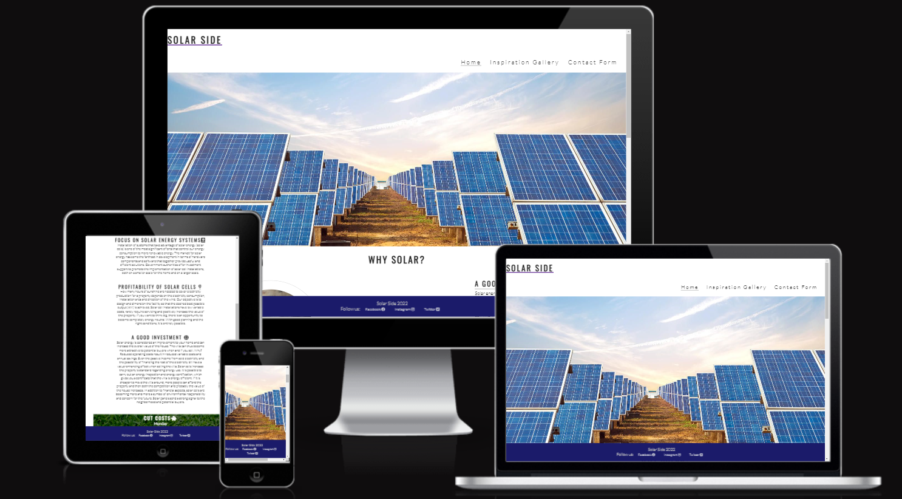
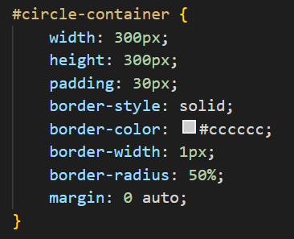
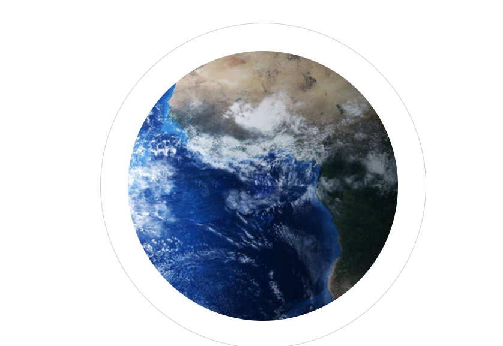

<h1>Solar Side</h1>

Website made to display benefits of using solar power, and with a contact form for detailed price information and stronger client relations.  

Menu will olso showcase an array of innovating idea's via Menu navigation > Inspiration gallery,  
 

The main image is an wide image of solar pannels with added zoom, animation duration is 7 seconds to full static picture.

I would like to credit Code Institute for the circle container css atributes.
Link to project, code starts at line 175.
<link href="https://learn.codeinstitute.net/courses/course-v1:CodeInstitute+LR101+2021_T1/courseware/4a07c57382724cfda5834497317f24d5/4d85cd1a2c57485abbd8ccec8c00732c/">

For making it possible to insert Earth image that fits the circle container and adds to the imersion of the website.