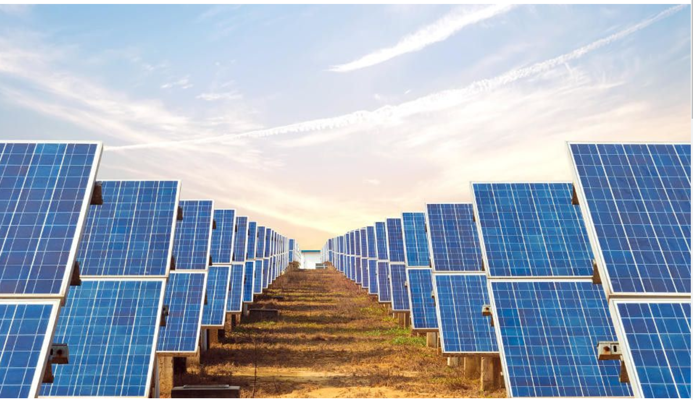

<h1>Solar Side</h1> 
Website made to display benefits of using solar power and with a gallery displaying the 3 types of solar panel materials that can be used, and with a contact form for further questions.
<li>Clients intrested in solar pannel types and wanting to know more.</li>  

<h1>Menu and main image</h1> 
<li>Will olso showcase the 3 types of solar panels via Menu navigation > Gallery</li> 

 

<strong>Credit to Code Institute for their Love Running module where they teached for the animation of the hero image.</strong>
<li>The main image is an wide image of solar pannels with added zoom, animation duration is 7 seconds to full static picture.</li>

<h1>GALLERY</h1>

<strong>For the Panel Gallery heading underline idea I want to give credit Tech2, youtube link is: 
https://www.youtube.com/watch?v=Trw_9lisYVY&t=798s&ab_channel=Tech2etc

Link to document: https://drive.google.com/drive/folders/1tHCYW4uvWmWTbGcQZlRvYxval1IAO8xS</strong>

<li>I made a normal 3 box flex container for the 3 typs of solar images since it was the method that worked best for me
The 3 images flex direction into colum at 765px X.</li>

<li>On big devices the 3 images display in a line.</li>

<h1>Contact Form.</h1>

<strong>I want to credit the contact form to Sefyudem, https://github.com/sefyudem/Contact-Us-Form/blob/master/style.css</strong>

<li>I added the solar panel check list next to the text input for better user experience and information. 
Back ground image aswell is changed and i choose that background because of the ambiet orange light and white it displays.
Container-box right (solar checklist image) is set to display:none; when viewed on mobile devices and is only visible on 1200px and up.</li>

<li>Preview of the contact page on big display.</li>

<h2>Smaller display for a clean minimalistic look.</h2>

<h1><strong>Benefits with fixed backkground</strong></h1>
<li>I added a 4 grid fixed background for smoother transition to the bottom grid With Profitability text.</li>

Profitability grid. 

<h2>Its colapsing into 2 colums at 745 x display.</h2>

 

<h2>>And at 549 x it's 1 colum scroll.</h2>

<h1><strong>Footer with Copyright and social links with icons</strong></h1>

<h1>User feedback/bugs found</h1>

<li>When opening from some IOS devices the panel header miss-aligns</li>

<li>On mobile device display ratio, the menu tab 'Home' is under contact form and not forming all 3 in row. This problem is only in Gallery and Contact Form pages</li>

This seems to have been fixed by adding the block-size: fit-content rule to body for 950px and down, code line 460.

<li>ONGOING issue: Seems there is a bug where opening developer tools makes the site aligs to much to the right but when viewed another time it perfectly fits. I have not found a fix for yet and i will continue trying to pin it down.</li>

<h1>Menu bug</h1>
<h2>>I have fixed this by changing the margin-right of #menu li from 30px to 25px, code line 59.

</h2

<h1>SEO and lighthouse scores</h1> 
<h2></h2>

<li>Lighthouse mobile score</li>
<h2></h2>
<li>Lighthouse Desktop score</li>
<h2></h2>

